# Compliance Document Chatbot

A self-hosted, retrieval-augmented (RAG) chatbot that answers compliance and regulatory questions from a library of roughly 1,000 PDFs (directions, circulars, guidelines and acts). Every answer quotes the source document, and clicking a citation opens the exact PDF page with the quoted sentence highlighted.

It was built for a bank's compliance team. It runs on an **air-gapped** server with a single GPU, so no data or queries ever leave the network, and it is designed to serve **50 concurrent users** with streamed answers.

---

## Features

- **Cited answers.** Every factual claim carries a verbatim quote and a numbered citation.
- **Click-to-source highlighting.** A citation opens the cited PDF page, rendered server-side, with the quoted text highlighted. Fuzzy matching handles hyphenation, ligatures and OCR noise.
- **Scanned PDFs supported.** Pages with no text layer are transcribed by a vision-language model during ingestion.
- **Streaming responses** over Server-Sent Events, token by token.
- **Conversation memory.** Follow-ups like "tell me more about it" or "make it shorter" resolve against the previous turn.
- **Question routing.** Identity, overview, single-document, broad and specific questions each get their own retrieval and token budget.
- **Safety gates.** It refuses to answer when retrieval confidence is low, rejects junk input, blocks prompt-extraction attempts, and filters profanity server-side.
- **Corpus-aware spell correction**, built from the indexed documents with no dictionary download.
- **Two-tier answer cache.** The exact-match tier is always on. The semantic tier ships disabled, with polarity guards, because near-identical compliance questions can have opposite answers.
- **Operational endpoints** for health, live stats (p50/p95/p99 latency and TTFT), corpus summary and cache control.
- **Per-user transcripts**, a readable audit log for each client.

## Architecture

```mermaid
flowchart LR
    subgraph Ingestion [Ingestion - one-off]
        A[PDF library] --> B[PyMuPDF text extraction]
        B -->|scanned pages| C[Vision LLM transcription]
        B --> D[Paragraph-aware chunking]
        C --> D
        D --> E[bge-small embeddings]
        E --> F[(vectors.npy + meta.jsonl)]
    end

    subgraph Serving
        U[Browser UI] -->|POST /ask/stream| G[FastAPI]
        G --> H[Query gate: profanity, junk, spelling, routing]
        H --> I[Answer cache]
        I -->|miss| J[Micro-batched embedder]
        J --> K[Exact cosine search]
        F --> K
        K --> L[Prompt builder: stable prefix, canonical order]
        L --> M[vLLM: Gemma, prefix cache, n-gram speculation]
        M -->|SSE tokens| U
        U -->|click citation| N[PyMuPDF page render + highlight]
    end
```



### Request lifecycle

1. **Gate.** Greetings, profanity and junk input are answered instantly, with no retrieval and no GPU use.
2. **Repair.** Typos are corrected against the corpus vocabulary, and follow-ups are expanded with terms from the previous turn. Both changes apply to the retrieval query only; the user's wording reaches the model unchanged.
3. **Route.** The question is classified as identity, overview, document, broad or specific, and gets that type's retrieval width, context size and answer length.
4. **Retrieve.** Concurrent queries are embedded in one ONNX batch, then searched with an exact matrix-vector product. Results are diversified across documents, or deepened within one document.
5. **Generate.** The model is prompted with a byte-stable system prompt and sources in canonical order, which maximises vLLM prefix-cache reuse. The answer streams back as it is generated.
6. **Finish.** Citations are renumbered to match the sources shown, stray brackets are removed, and one highlight target is computed per citation.

## Tech stack

| Layer | Technology |
|---|---|
| API | FastAPI, Uvicorn, Pydantic v2, Server-Sent Events |
| LLM serving | vLLM (OpenAI-compatible API), Gemma 4 E2B instruction-tuned |
| Embeddings | fastembed (ONNX Runtime), BAAI/bge-small-en-v1.5 |
| Vector search | NumPy exact cosine search on a memory-mapped matrix, with optional HNSW (hnswlib) |
| PDF processing | PyMuPDF for extraction, rendering and highlight annotations |
| HTTP client | httpx (async, pooled) |
| Frontend | Single-file HTML/CSS/JS with no third-party libraries |
| Deployment | Docker, Docker Compose, NVIDIA GPU, fully offline build |

## Project structure

```
server.py                  FastAPI app: request pipeline, citations, PDF endpoints
retriever.py               Vector index, micro-batched query embedder, diversification
llm.py                     Async vLLM client with least-in-flight load balancing
prompts.py                 System prompt, question routing, per-type budgets
queryfix.py                Spell correction, quality gate, follow-up detection, profanity filter
cache.py                   Two-tier answer cache with polarity guards
sessions.py                Server-side conversation memory with LRU + TTL
usagelog.py                Per-user readable transcripts
config.py                  All settings, each overridable by environment variable
ingest.py                  PDFs to chunks to embeddings to index
selftest.py                Offline validation of index, retrieval and highlighter
benchmark.py               Concurrent load test (TTFT and total latency percentiles)
static/index.html          Chat UI
docker-compose.yml         Serving stack (text-only vLLM + app)
docker-compose.ingest.yml  Override that enables the vision model for ingestion
```

## Getting started

### Prerequisites

- An NVIDIA GPU with 24 GB VRAM, Docker, and the NVIDIA Container Toolkit
- The Gemma 4 E2B model weights in `./gemma-4-E2B-it/`
- Your PDFs in `./dataset/` (subfolders become collections)

### 1. Configure

```bash
cp .env.example .env
# set VLLM_API_KEY to any secret string; it secures the vLLM endpoint
```

### 2. Build the index

```bash
docker compose -f docker-compose.yml -f docker-compose.ingest.yml up -d vllm
docker compose -f docker-compose.yml -f docker-compose.ingest.yml run --rm app python ingest.py
```

Use `--no-vision` to skip scanned pages for a much faster first run. Use `--from-pages` to rebuild embeddings without repeating OCR.

### 3. Validate (no GPU needed)

```bash
docker compose run --rm --no-deps app python selftest.py
```

### 4. Serve

```bash
docker compose up -d
```

Open `http://localhost:8001`. The interactive API docs are at `/docs`.

### 5. Load test

```bash
python benchmark.py --users 50 --requests 200
```

## API

| Method | Endpoint | Purpose |
|---|---|---|
| POST | `/ask/stream` | Streamed answer (SSE: `meta`, `token`, `sources`, `done`) |
| POST | `/ask` | Non-streamed answer |
| POST | `/session/new` | Start a new conversation |
| GET | `/api/page_image` | Render a PDF page with the quote highlighted |
| GET | `/api/locate` | Find the page that actually contains a cited sentence |
| GET | `/api/pdf` | Original PDF, optionally with a highlight annotation |
| GET | `/corpus` | What the knowledge base contains |
| GET | `/stats` | Latency percentiles, cache, retrieval and session statistics |
| GET | `/health` | Liveness and readiness |

## Configuration

Every setting in `config.py` can be overridden with an environment variable. The main settings are:

| Variable | Default | Effect |
|---|---|---|
| `MIN_SCORE` | `0.45` | Minimum retrieval similarity to answer instead of saying "not found" |
| `ANSWER_TOKEN_CAP` | `0` (off) | Global ceiling on answer length (the main latency control) |
| `CONTEXT_CHAR_CAP` | `0` (off) | Global ceiling on retrieved context (the main time-to-first-token control) |
| `SESSION_MAX_QUESTIONS` | `20` | Questions per conversation |
| `MAX_INFLIGHT` | `256` | Admission limit; beyond it the API returns 503 with Retry-After |
| `CACHE_SEMANTIC_ENABLED` | `false` | Semantic cache (see `config.py` for why it is off) |
| `PROFANITY_REFUSE` | `true` | Server-side offensive-language refusal |

## Design decisions

- **No vector database.** At about 40k chunks, an exact NumPy matmul takes about 1 ms and has perfect recall. A database round trip per query would add latency and hold the GIL. HNSW is used automatically only above 150k chunks.
- **Prompt layout serves the prefix cache.** The system prompt never changes, and sources are ordered by chunk ID rather than by score. Requests that share a prefix therefore reuse its KV cache across users.
- **Text-only serving.** Scanned pages are transcribed once at ingestion, so the serving model skips loading its vision and audio towers. That memory goes to KV cache instead.
- **N-gram speculative decoding.** The model is told to quote sources verbatim, so many output tokens already appear in the prompt. Prompt-lookup speculation exploits this at no VRAM cost.
- **Highlighting is rendered server-side.** The client needs no PDF.js. The same code that finds the quote also draws the box, so the highlight cannot drift.
- **Refusing beats guessing.** Low-confidence retrieval returns "not found" rather than a plausible but wrong cited answer.
